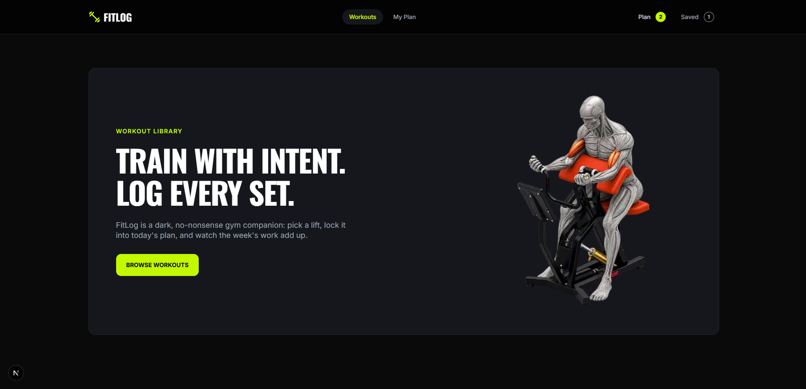

# FITLOG

A no-nonsense workout companion built to help you discover exercises, build your plan, and train with intent.

## Technologies Used

* **Next.js** 
* **TypeScript** 
* **Tailwind CSS** 
* **DaisyUI** 
* **React Icons** 
* **React Toastify** 

## Key Features

### 1. Workout Library

Browse a collection of exercises with information such as muscle groups, equipment, difficulty, duration, calories, sets, reps, and ratings.

### 2. Workout Details

View detailed information for each workout, including descriptions, specifications, and step-by-step instructions.

### 3. Today's Workout Plan

Add workouts to a personal daily plan and track completed exercises.

### 4. Save Workouts

Save exercises for later and easily access them from the **Saved** section.

### 5. Sort & Data Storage

Sort exercises by **duration, calories, or rating** in **Today's Plan** and **Saved** tabs, with persistent workout data stored using **LocalStorage**.

## Project Links

- **Live Link:** [FITLOG](https://fit-log-liart-chi.vercel.app/)
- **GitHub Repository:** [GitHub]()

